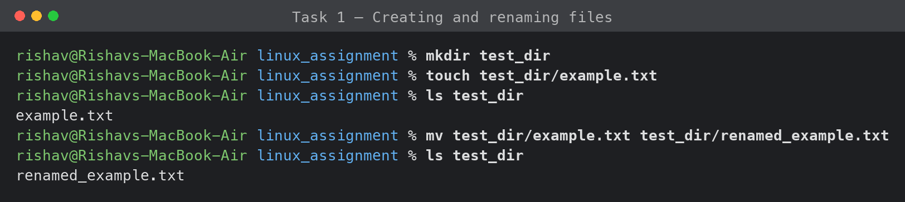
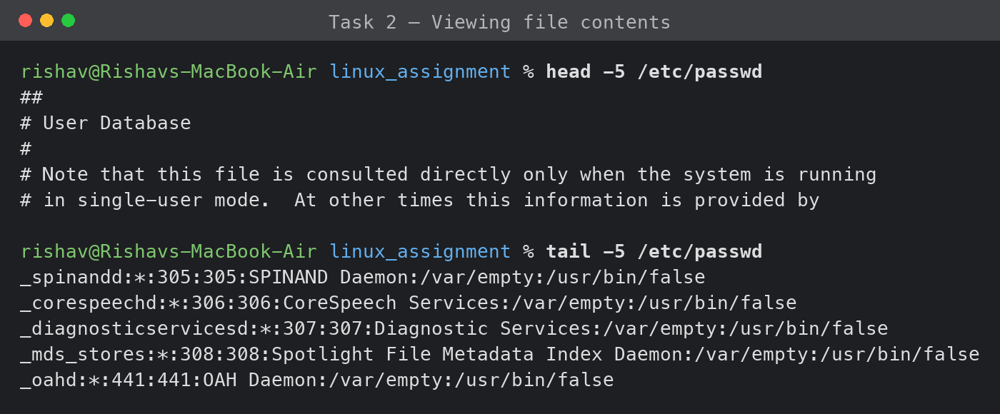
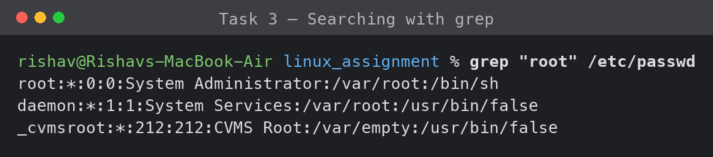
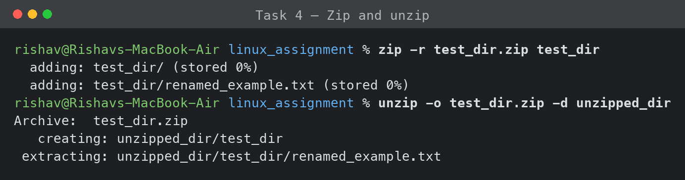
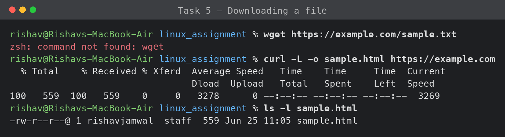
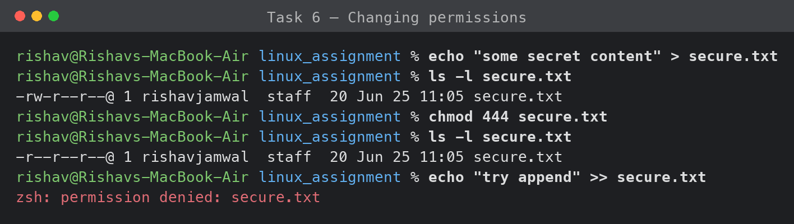
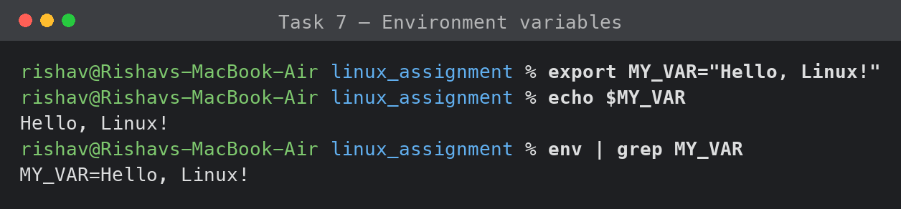

# Linux Commands Assignment

Name: Rishav Jamwal

I did all of this on my Mac using the Terminal (zsh shell). I made a folder called `linux_assignment` and worked inside it. Below is what I did for each part and what I got back. Most of these are normal Linux commands so they work the same on Linux too. The only one that was different is wget, which my Mac didn't have, so I used curl instead and explained that part.

## 1. Creating and renaming files

First I made a folder with mkdir, then made an empty file inside it with touch, and finally renamed the file using mv.

```bash
mkdir test_dir
touch test_dir/example.txt
mv test_dir/example.txt test_dir/renamed_example.txt
```

After running mv the file showed up as renamed_example.txt when I listed the folder. So mv basically renames the file when you keep it in the same folder. touch is handy because it just makes a blank file without opening any editor.



## 2. Looking at file contents

I used the /etc/passwd file for this since it's always there. cat prints the whole thing, head shows the top of the file and tail shows the bottom.

```bash
cat /etc/passwd
head -5 /etc/passwd
tail -5 /etc/passwd
```

head -5 gave me the first 5 lines, which on a Mac are just comment lines at the top:

```
##
# User Database
#
# Note that this file is consulted directly only when the system is running
# in single-user mode.  At other times this information is provided by
```

And tail -5 gave the last 5 lines, which are the system accounts:

```
_spinandd:*:305:305:SPINAND Daemon:/var/empty:/usr/bin/false
_corespeechd:*:306:306:CoreSpeech Services:/var/empty:/usr/bin/false
_diagnosticservicesd:*:307:307:Diagnostic Services:/var/empty:/usr/bin/false
_mds_stores:*:308:308:Spotlight File Metadata Index Daemon:/var/empty:/usr/bin/false
_oahd:*:441:441:OAH Daemon:/var/empty:/usr/bin/false
```

I used head and tail with -5 so I didn't have to scroll through the whole file. cat is fine for short files but for big ones head/tail are nicer.



## 3. Searching with grep

Then I searched for the word root inside /etc/passwd.

```bash
grep "root" /etc/passwd
```

It printed back every line that had root in it:

```
root:*:0:0:System Administrator:/var/root:/bin/sh
daemon:*:1:1:System Services:/var/root:/usr/bin/false
_cvmsroot:*:212:212:CVMS Root:/var/empty:/usr/bin/false
```

grep goes line by line and only shows the lines that match what you searched for. There are a couple of system lines that point to /var/root as their home folder, so those came up too.



## 4. Zipping and unzipping

I zipped the whole test_dir folder and then unzipped it into a fresh folder to check it worked.

```bash
zip -r test_dir.zip test_dir
unzip -o test_dir.zip -d unzipped_dir
```

The -r part is important because it tells zip to include everything inside the folder, not just the folder name. When I unzipped it, the renamed_example.txt file was sitting inside unzipped_dir/test_dir, exactly like the original. The -d just lets you pick which folder to extract into.



## 5. Downloading a file

The task asked to use wget, but when I tried it I got "command not found" because Macs don't come with wget installed. So I used curl instead, which does the same job. (If I wanted the real wget I could install it with brew install wget.)

```bash
wget https://example.com/sample.txt        # this is the Linux way
curl -L -o sample.html https://example.com   # what I actually used on Mac
```

curl downloaded the file and saved it as sample.html. The -o lets you name the saved file and -L makes it follow redirects in case the link bounces somewhere else. I also noticed the sample.txt link in the example doesn't really exist (gives a 404), so I just downloaded the example.com homepage to show the download working.



## 6. Changing permissions

I made a file called secure.txt and then used chmod to make it read only for everyone.

```bash
echo "some secret content" > secure.txt
chmod 444 secure.txt
```

Before the change the permissions were -rw-r--r-- and after they became -r--r--r--. To test it I tried to add more text to the file and the terminal said "permission denied", which is exactly what should happen since I took away write access. The 444 is in octal where 4 means read, 2 means write and 1 means execute, and the three digits are for the owner, the group and everyone else. So 444 is read for all three and nothing else. I can undo it with chmod 644 later if I need to edit it again.



## 7. Environment variables

Last one. I set my own environment variable with export and then printed it out.

```bash
export MY_VAR="Hello, Linux!"
echo $MY_VAR
env | grep MY_VAR
```

echo $MY_VAR printed Hello, Linux! and when I ran env (which lists all the variables) I could see MY_VAR=Hello, Linux! in there too. One thing to remember is that this only lasts for the current terminal window. If I close it the variable is gone, so to keep it permanently I'd add the export line to my ~/.zshrc file.



## Wrap up

All seven tasks worked. The only thing that needed changing was wget since it isn't on Mac by default, so I used curl which does the same thing. Everything else ran without any problems. The terminal screenshots above show each command with its real output, and they're also in the submission doc.
